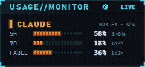
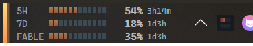
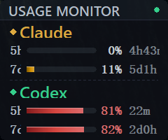
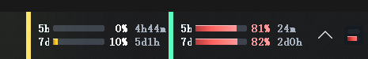

# Claude Codex Usage Monitor

[中文](#中文说明) | [English](#english)

## 中文说明

### 项目简介
`Claude Codex Usage Monitor` 是一个 Windows 桌面实时用量监控工具，显示 Claude Code（5 小时 / 7 天 / Fable 周额度）、Codex 与 Cursor 的使用率和重置倒计时。

### 界面截图

#### Neon HUD 主题（默认）
悬浮窗：



任务栏嵌入（AppBar）：



#### Classic 主题



### 主要特性
- 三通道监控：Claude、Codex、Cursor 可分别开关。
- Claude 额度窗口动态显示：5h、7d，以及按模型的周额度（例如 Fable）；启用了 Extra 用量时自动多一行。
- 两套主题：Neon HUD（8px 点阵、发光分段条、青色结构线）与 Classic，托盘菜单「主题」随时切换。
- 多展示模式：悬浮窗与任务栏嵌入（AppBar），列宽随 DPI 缩放。
- 状态感知：接口限流时保留上次数据并标注「as of Xm ago」；凭据失效时提示「打开一次 Claude Code 即可恢复」。
- 托盘交互：左键显示/隐藏，右键完整菜单；动态托盘图标显示双进度条。
- 自动刷新：Claude 接口轮询下限 120 秒，429 时指数退避到 15 分钟。

### 数据来源
- Claude：读取 `~/.claude/.credentials.json` 的 OAuth token，请求 `https://api.anthropic.com/api/oauth/usage`。token 过期或被拒时通过 Claude Code CLI 的 headless `get_usage` 控制请求刷新，本程序不接触 refresh token，不会影响 Claude Code 登录态。
- Codex：`~/.codex/auth.json` + ChatGPT 用量接口。
- Cursor：粘贴浏览器 Cookie 后读取个人套餐用量。

### 运行环境
- Windows 10/11
- 已登录的 Claude Code CLI（`claude`）；Codex / Cursor 可选

### 安装
从 [GitHub Releases](https://github.com/Sundogs-s/Claude-Codex-Usage-Monitor/releases) 下载 `UsageMonitor-<version>-Setup.exe` 运行即可；支持静默安装 `/S`。

### 本地构建
```bash
cargo build --release
.\target\release\usage-monitor.exe
```
打包安装程序需要 NSIS：运行 `build_installer.bat`。

### 诊断
- 日志：`%LOCALAPPDATA%\UsageMonitor\_runtime_logs\usage-monitor.log`（5 MB 轮转；`USAGE_MONITOR_DEBUG=1` 打开 Debug）。
- `usage-monitor.exe --probe` 直连一次额度接口；`--probe --cli` 走 Claude Code CLI 刷新路径。

### 技术栈
- Rust 2021，Windows API（`windows` crate，GDI 绘制）
- Tokio + Reqwest

---

## English

### Overview
`Claude Codex Usage Monitor` is a Windows desktop utility that shows real-time usage for Claude Code (5-hour / 7-day / per-model weekly windows such as Fable), Codex and Cursor, with reset countdowns.

### Screenshots

#### Neon HUD theme (default)
Floating window:


Taskbar-embedded AppBar:


#### Classic theme


### Features
- Three channels — Claude, Codex, Cursor — each can be toggled.
- Dynamic Claude windows: 5h, 7d and per-model weekly limits (e.g. Fable); an Extra-usage row appears when enabled.
- Two themes: Neon HUD (8px pixel grid, glowing segmented bars, cyan structure) and Classic, switchable from the tray menu.
- Display modes: floating window and taskbar-embedded AppBar; column widths follow the DPI.
- State-aware: keeps last-known data with an "as of Xm ago" note while the usage API is rate-limited; tells you to open Claude Code once when credentials expire.
- Tray: left click to show/hide, right click for the full menu; dynamic tray icon with two progress bars.
- Polling floor of 120 s for the Claude usage API with exponential back-off (up to 15 min) on 429.

### Data sources
- Claude: OAuth token from `~/.claude/.credentials.json` against `https://api.anthropic.com/api/oauth/usage`. Expired or rejected tokens are refreshed through the Claude Code CLI's headless `get_usage` control request; the monitor never touches the refresh token, so it cannot break your Claude Code login.
- Codex: `~/.codex/auth.json` + the ChatGPT usage endpoint.
- Cursor: personal-plan usage via a pasted browser cookie.

### Requirements
- Windows 10/11
- A signed-in Claude Code CLI (`claude`); Codex / Cursor optional

### Install
Download `UsageMonitor-<version>-Setup.exe` from [GitHub Releases](https://github.com/Sundogs-s/Claude-Codex-Usage-Monitor/releases) and run it; `/S` installs silently.

### Build
```bash
cargo build --release
.\target\release\usage-monitor.exe
```
Packaging the installer needs NSIS: run `build_installer.bat`.

### Diagnostics
- Log: `%LOCALAPPDATA%\UsageMonitor\_runtime_logs\usage-monitor.log` (5 MB rotation; `USAGE_MONITOR_DEBUG=1` for Debug).
- `usage-monitor.exe --probe` hits the usage endpoint once; `--probe --cli` exercises the Claude Code CLI refresh path.

### Tech Stack
- Rust 2021, Windows API (`windows` crate, GDI rendering)
- Tokio + Reqwest
